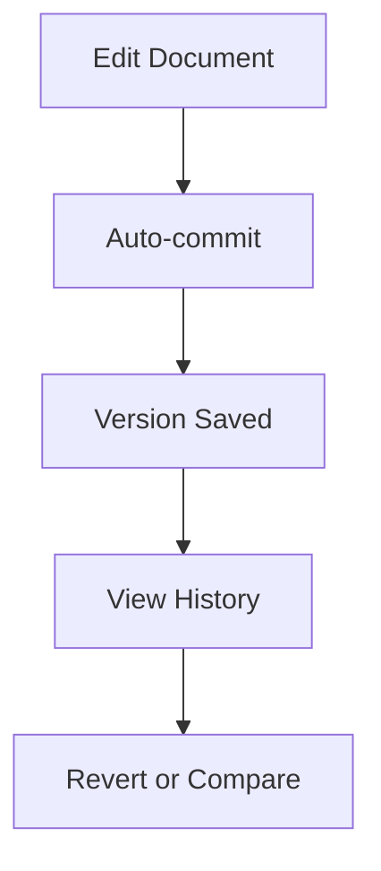

## Document Organization Tools

You organize your project documentation efficiently using built-in tools like folders, tags, and advanced search. Create nested folders to structure content hierarchically, apply tags for quick filtering, and leverage full-text search to locate documents instantly.

<Columns cols={3}>
  <Card title="Folders" icon="folder" href="#">
    Nest documents up to 10 levels deep for complex projects.
  </Card>
  <Card title="Tags" icon="tag" href="#">
    Assign multiple tags per document for flexible categorization.
  </Card>
  <Card title="Search" icon="search" href="#">
    Full-text search with highlighting and filters.
  </Card>
</Columns>

<Callout kind="tip">
  Combine folders and tags for optimal organization. For example, use folders for high-level structure and tags for cross-project themes.
</Callout>

## Collaboration Capabilities

Invite team members to collaborate in real-time. Share documents via public links, add comments for feedback, and track changes with @mentions.

<Tabs>
  <Tab title="Real-time Editing" icon="edit-3">
    Multiple users edit simultaneously with live cursors and conflict resolution.
  </Tab>
  <Tab title="Comments" icon="message-circle">
    Threaded discussions on specific sections with resolved states.
  </Tab>
  <Tab title="Sharing" icon="share-2">
    Generate secure links with view, edit, or comment permissions.
  </Tab>
</Tabs>

<Steps>
  <Step title="Invite Collaborators" icon="users">
    Go to document settings and add emails. They receive instant access.
  </Step>
  <Step title="Set Permissions" icon="shield">
    Choose roles: Viewer, Editor, or Admin for granular control.
  </Step>
  <Step title="Notify Changes" icon="bell">
    Enable notifications for edits and comments.
  </Step>
</Steps>

## Version Control Basics

Maintain document history with automatic versioning powered by Git integration. Revert changes, compare versions, and branch for experiments.



<CodeGroup tabs="Git CLI,Platform UI">
  ```bash
  git add docs/features.mdx
  git commit -m "Update collaboration section"
  git push origin main
  ```
  ```typescript
  // Platform API example
  await api.documents.createVersion({
    docId: "features-mdx",
    message: "Added version control details"
  });
  ```
</CodeGroup>

<Expandable title="Advanced Version Workflows" default-open="false">

Use branching for safe experimentation:

| Feature       | Description                          | Use Case                  |
|---------------|--------------------------------------|---------------------------|
| Branching     | Create isolated versions             | Feature testing           |
| Merge Requests| Review changes before merging        | Team approvals            |
| Rollback      | Revert to any previous version       | Quick recovery            |

</Expandable>

These core features empower you to manage Sai Gautham Kishtapuram Documentation projects seamlessly, from organization to deployment. Start by creating your first folder today.