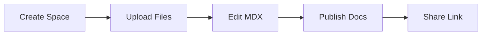

## Overview

Get started with Sai Gautham Kishtapuram Documentation in minutes. You create a new space, upload your markdown files, and begin editing with live previews. This guide walks you through the essentials using simple steps.

<Columns cols={3}>
  <Card title="Create Space" icon="plus" href="#create-space">
    Set up your project home.
  </Card>
  <Card title="Upload Content" icon="upload" href="#upload-content">
    Add your MDX files quickly.
  </Card>
  <Card title="Navigate & Edit" icon="edit-3" href="#navigate-edit">
    Explore the editor interface.
  </Card>
</Columns>

## Create a New Documentation Space

Follow these steps to initialize your first space.

<Steps>
  <Step title="Sign In" icon="log-in">
    Visit the Sai Gautham Kishtapuram dashboard and click **New Space**.
  </Step>
  <Step title="Configure Basics" icon="settings">
    Enter your space name, like `my-project-docs`, and select the brand color `#3B82F6`.
  </Step>
  <Step title="Save and Access" icon="check-circle">
    Click **Create**. Your space appears in the sidebar.
  </Step>
</Steps>

<Callout kind="tip">
  Choose a descriptive name for your space. You organize multiple projects across spaces.
</Callout>

## Upload Initial Content

Upload your existing markdown or MDX files using these methods.

<Tabs>
  <Tab title="Drag & Drop" icon="mouse-pointer">
    Open your space, navigate to the root folder, and drag files directly into the file tree.

    Supported formats include `.md`, `.mdx`, and images.

    <Image
      src="https://example.com/drag-drop.png"
      alt="Drag and drop files into the file tree"
      width="600"
      height="400"
    />
  </Tab>
  <Tab title="CLI Upload" icon="terminal">
    Use the CLI for bulk uploads.

    <CodeGroup tabs="npm,yarn">
```bash
npm install -g sai-docs-cli
sai-docs upload /path/to/docs my-project-docs
```
```bash
yarn global add sai-docs-cli
sai-docs upload /path/to/docs my-project-docs
```
    </CodeGroup>
  </Tab>
</Tabs>

## Basic Navigation and Editing

Master the interface quickly.

### File Tree Navigation

Use the left sidebar to browse files. Click any `.mdx` file to open it.

- **Expand folders** with the chevron icon.
- **Search files** using `Ctrl+P` (or `Cmd+P` on macOS).
- **Create new files** with `+ New File`.

### Edit with Live Preview

The editor splits into source and preview panes.

<Expandable title="Editor Shortcuts" default-open="false">
  - `Ctrl+S`: Save changes.
  - `Ctrl+/`: Toggle comments.
  - `Ctrl+Shift+P`: Open command palette.
</Expandable>

<CodeGroup tabs="Before,After">
```markdown
# Old Title

Basic content without components.
```
```mdx
## Enhanced Title

<Callout kind="info">Now with components!</Callout>
```
</CodeGroup>

## Next Steps

Explore advanced features.

<Columns cols={2}>
  <Card title="Customize Theme" icon="palette" href="/docs/theme">
    Adjust colors and layouts.
  </Card>
  <Card title="Add Components" icon="puzzle" href="/docs/components">
    Use rich MDX elements.
  </Card>
</Columns>



You now have a fully functional documentation site. Publish by toggling the live switch in settings.