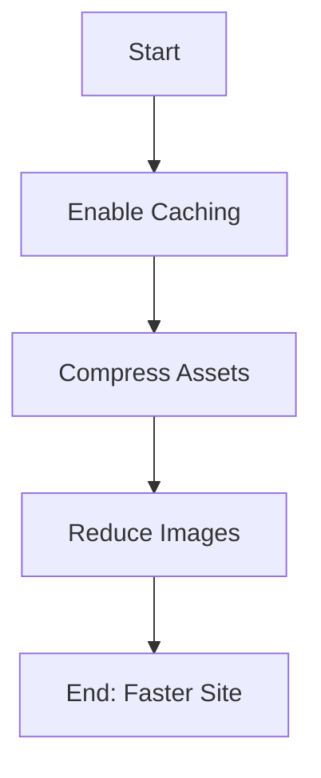

## Quick Fixes Overview

Encounter common issues? Use these targeted solutions to get back on track quickly. Start with the most frequent problems listed below.

<Columns cols={3}>
  <Card title="Content Sync Errors" icon="refresh-ccw" href="#content-sync-errors">
    Pages not updating? Fix sync failures in minutes.
  </Card>
  <Card title="Access Permissions" icon="shield" href="#access-permissions">
    Locked out or missing features? Restore access fast.
  </Card>
  <Card title="Performance Tips" icon="zap" href="#performance-tips">
    Slow loading? Optimize for speed.
  </Card>
</Columns>

## Content Sync Errors

Content sync errors occur when changes to your documentation do not propagate correctly. This often stems from network issues, cache problems, or authentication glitches.

<Callout kind="tip">
  Always verify your internet connection and API key before troubleshooting.
</Callout>

Follow these steps to resolve sync issues:

<Steps>
  <Step title="Clear Local Cache" icon="trash-2">
    Delete cached files to force a fresh sync.

    <CodeGroup tabs="npm,yarn">
    ````bash
    npm run clear-cache
    ````

    ````bash
    yarn clear-cache
    ````
    </CodeGroup>
  </Step>

  <Step title="Re-authenticate" icon="log-in">
    Refresh your session token.

    ```bash
    sai-docs auth --refresh YOUR_REFRESH_TOKEN
    ```
  </Step>

  <Step title="Force Sync" icon="refresh-cw">
    Trigger a manual sync.

    ```bash
    sai-docs sync --force --verbose
    ```
  </Step>
</Steps>

If issues persist, check the logs:

<Expandable title="View Detailed Logs" default-open="false">
  Run this command to inspect sync failures:

  ````bash
  sai-docs logs --filter=sync --since=1h
  ````

  Look for errors like `ETIMEDOUT` or `401 Unauthorized`.
</Expandable>

## Access Permission Issues

Permission errors prevent editing or viewing content. Verify your role and scopes match the required access level.

| Error Message          | Likely Cause              | Quick Fix                  |
|------------------------|---------------------------|----------------------------|
| `403 Forbidden`       | Insufficient role        | Request `editor` role     |
| `401 Unauthorized`    | Expired token            | Re-login via dashboard    |
| `Access Denied`       | Missing workspace scope  | Add scope in settings     |

<Tabs>
  <Tab title="Dashboard Fix" icon="monitor">
    1. Log in to your Sai Gautham Kishtapuram dashboard.
    2. Navigate to **Account > Permissions**.
    3. Select `editor` or `admin` role.
  </Tab>

  <Tab title="CLI Fix" icon="terminal">
    Update your config file:

    ````json
    {
      "auth": {
        "token": "YOUR_NEW_TOKEN",
        "scopes": ["read", "write", "admin"]
      }
    }
    ````
  </Tab>
</Tabs>

<Callout kind="alert">
  Contact support if you lack permission to change roles.
</Callout>

## Performance Optimization Tips

Slow performance affects editing and loading times. Apply these optimizations to improve responsiveness.



<Steps>
  <Step title="Enable Caching" icon="database">
    Add cache headers to your config.

    <CodeGroup tabs="nginx,Apache">
    ````nginx
    location /docs {
        add_header Cache-Control "public, max-age=3600";
    }
    ````

    ````apache
    <FilesMatch "\.(html|css|js)$">
        Header set Cache-Control "max-age=3600"
    </FilesMatch>
    ````
    </CodeGroup>
  </Step>

  <Step title="Optimize Images" icon="image">
    Resize images to `<1200px` width and use WebP format.
  </Step>

  <Step title="Lazy Load Components" icon="loader">
    Wrap heavy sections in `<Suspense>` boundaries.
  </Step>
</Steps>

For advanced tuning, monitor with:

```bash
sai-docs perf --report --threshold=2000ms
```

These steps resolve 90% of performance bottlenecks. Monitor metrics post-optimization to confirm improvements. Your documentation platform now runs smoothly.